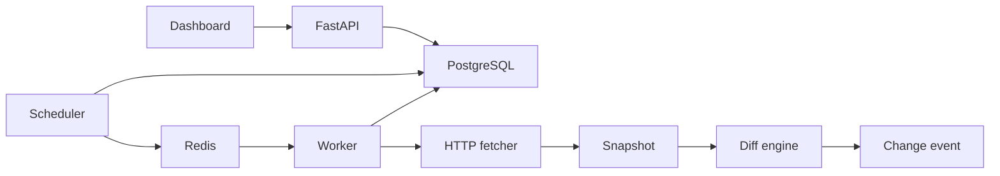

# Watchtower

Watchtower is a self-hosted website change monitoring platform built around a durable PostgreSQL baseline, centralized scheduler, Redis queue, isolated workers, and a real diff pipeline.

## Quick start

```bash
cp .env.example .env
# Replace both secret values; generate the encryption key as documented in .env.example.
docker compose up --build
docker compose run --rm api alembic upgrade head
```

The API is served on `http://localhost:8000`, and the dashboard on `http://localhost:3000`.

For the deterministic product fixture:

```bash
docker compose --profile demo up --build
make demo-change
```

Private, loopback, link-local, reserved, and metadata destinations are denied by default after DNS resolution. Redirect destinations are checked before they are requested. Failed checks and HTTP error pages never advance the last known-good baseline.

## Architecture



The current implementation is an early but functional HTTP-monitoring slice. Browser execution, authentication, notification outbox, retention, and the remaining dashboard workflows are not yet claimed complete.
